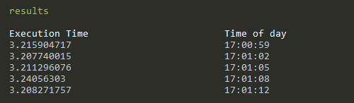

# bat-execution-time

> :clock1: CLI to measure the execution time for a bat file over a period of time

[![NPM version][version-image]][version-url]
[![Dependency Status][david-image]][david-url]
[![License][license-image]][license-url]
[![Js Standard Style][standard-image]][standard-url]

## Installation

```bash
$ npm install -g bat-execution-time
```

## Usage

```bash
bat-execution-time [batfile] [args]

Options:
  --times, -t   run the tests `t` times                    [number] [default: 1]
  --output, -o  write the results into a json file                      [string]
  -h, --help    Show help                                              [boolean]
```

### Example



```bash
$ bat-execution-time .\test\fixtures\test.bat -t 5
```

## License

[MIT][license-url]

[version-image]: https://img.shields.io/npm/v/bat-execution-time.svg?style=flat-square

[version-url]: https://npmjs.org/package/bat-execution-time

[david-image]: http://img.shields.io/david/kanton-aargau/bat-execution-time.svg?style=flat-square

[david-url]: https://david-dm.org/kanton-aargau/bat-execution-time

[standard-image]: https://img.shields.io/badge/code-standard-brightgreen.svg?style=flat-square

[standard-url]: https://github.com/feross/standard

[license-image]: http://img.shields.io/npm/l/bat-execution-time.svg?style=flat-square

[license-url]: ./license